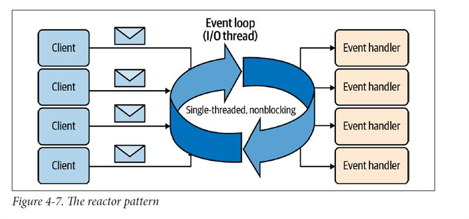
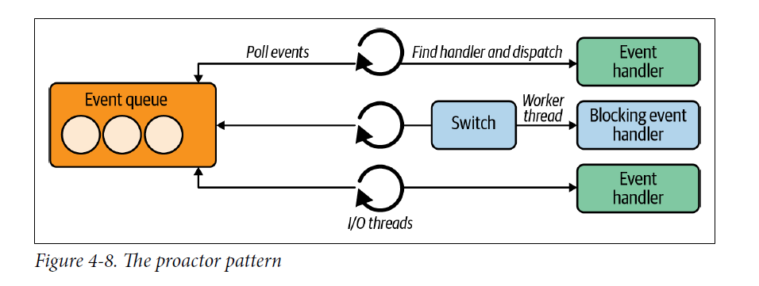
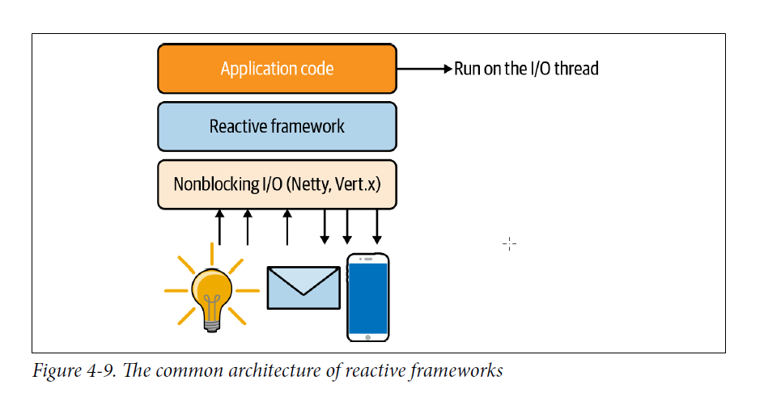

# code-with-quarkus

This project uses Quarkus, the Supersonic Subatomic Java Framework.

If you want to learn more about Quarkus, please visit its website: <https://quarkus.io/>.

## Running the application in dev mode

You can run your application in dev mode that enables live coding using:

```shell script
./mvnw quarkus:dev
```

> **_NOTE:_**  Quarkus now ships with a Dev UI, which is available in dev mode only at <http://localhost:8080/q/dev/>.

## Packaging and running the application

The application can be packaged using:

```shell script
./mvnw package
```

It produces the `quarkus-run.jar` file in the `target/quarkus-app/` directory.
Be aware that it’s not an _über-jar_ as the dependencies are copied into the `target/quarkus-app/lib/` directory.

The application is now runnable using `java -jar target/quarkus-app/quarkus-run.jar`.

If you want to build an _über-jar_, execute the following command:

```shell script
./mvnw package -Dquarkus.package.jar.type=uber-jar
```

The application, packaged as an _über-jar_, is now runnable using `java -jar target/*-runner.jar`.

## Creating a native executable

You can create a native executable using:

```shell script
./mvnw package -Dnative
```

Or, if you don't have GraalVM installed, you can run the native executable build in a container using:

```shell script
./mvnw package -Dnative -Dquarkus.native.container-build=true
```

You can then execute your native executable with: `./target/code-with-quarkus-1.0.0-SNAPSHOT-runner`

If you want to learn more about building native executables, please consult <https://quarkus.io/guides/maven-tooling>.

## Related Guides

- RESTEasy Classic ([guide](https://quarkus.io/guides/resteasy)): REST endpoint framework implementing Jakarta REST and more

## Provided Code

### RESTEasy JAX-RS

Easily start your RESTful Web Services

[Related guide section...](https://quarkus.io/guides/getting-started#the-jax-rs-resources)

### Create Kubernetes cluster
- Follow to install and create cluster with minikube: https://minikube.sigs.k8s.io/docs/start/?arch=%2Fwindows%2Fx86-64%2Fstable%2F.exe+download

- In this section, we will use a NodePort Service to allow to access service within Kubernetes. Check running services with: minikube services list

### Monitoring the amount of containerized services inside pod: 
```shell script
minikube addons enable metrics-server
```

### Deployment for pods
- Note: to avoid building and pushing image to registry before using incase we want to use Docker image right in VM/container created by Minikube use this command: 
```shell script
minikube start # if minikube is not started
eval $(minikube -p minikube docker-env)
```
-> This will set the output environment in the CURRENT shell (in the CURRENT terminal window). Then when build image at local, it will compile and deploy right in the cluster.

*** Check our minikube is ready with command for checking current nodes: 
```shell script
kubectl get nodes
```

- Check the deployments with: **kubectl get deployments**. File deployment will be created in target/kubernetes/minikube.yml

### Deploy to Kubernetes: 
```shell script
mvn verify -Dquarkus.kubernetes.deploy=true
```

- Check the deployed service (get the name from service in file deployment.yaml) by exposing it:
```shell script
minikube service code-with-quarkus --url  
```

- Measure resource usage using kubeccha, with the following command will checkthe usage of our containerized service:
```shell script
kubectl top pods
```

### Build a native executable for Quarkus with GraalVM to optimize the build process during build time
- Prerequisite: following the instruction "Building a Native Executable" to make sure they are installed correcly: https://quarkus.io/guides/building-native-image

- Compile Quarkus application into executable binary codes:
```shell script
 mvn verify -Pnative
```

- Note: Since building native executable binary codes takes longer than usual JVM builds so this should be included only in CI pipeline.

1. Since the native executable binary file is available, we also can build the image with Dockerfile setup and run it (locally):
```shell script
# Dockerfile.native-micro
FROM quay.io/quarkus/ubi9-quarkus-micro-image:2.0
WORKDIR /work/
RUN chown 1001 /work \
    && chmod "g+rwX" /work \
    && chown 1001:root /work
COPY --chown=1001:root --chmod=755 target/*-runner /work/application

EXPOSE 8080
USER 1001

ENTRYPOINT ["./application", "-Dquarkus.http.host=0.0.0.0"] # the entry point of app

# We also have a default Dockerfile.native with bigger image and more utilities
FROM registry.access.redhat.com/ubi9/ubi-minimal:9.5
WORKDIR /work/
RUN chown 1001 /work \
    && chmod "g+rwX" /work \
    && chown 1001:root /work
COPY --chown=1001:root --chmod=0755 target/*-runner /work/application

EXPOSE 8080
USER 1001

CMD ["./application", "-Dquarkus.http.host=0.0.0.0"]

# Build image and run ( getting-start: name of built jar file, quarkus-quickstart/getting-started: name of container)
docker build -f src/main/docker/Dockerfile.native-micro -t quarkus-quickstart/getting-started .
docker run -i --rm -p 8080:8080 quarkus-quickstart/getting-started
```

2. Either using terminal shell from Docker daemon within Minikube and run command:
```shell script
docker build -f src/main/docker/Dockerfile.native \
-t <_your_docker_username_>/code-with-quarkus:1.0.0-SNAPSHOT .

# create the minikube deployment
kubectl apply -f target/kubernetes/minikube.yml

# Verity and run the container
mvn verify -Pnative -Dquarkus.native.container-build=true
```

### Test Interceptor to understand about fault resolver:
```shell script
curl http://127.0.0.1:63905/fault?mode=INBOUND_REQUEST_LOSS # change mode to inject the desired faulty resolver
curl --max-time 5 http://127.0.0.1:63905/
curl --max-time 5 --retry 100 --retry-all-errors http://127.0.0.1:63905/
```

Note: please be cautious that retry should be used only if that service is idempotent: Even call 1 time or multiple times with the same data and conditions, the result will be identical and there are no additional side effects, repeated data or unexpected result.

### Reactive framework architecture
Based on two Reactive patterns: multireactor(like Vert.x) and proactor(like Quarkus):


=> In the multireactor pattern, event loop as a single-thread loop, with responsibility: listen I/O operations, event is ready, enqueue it and dispatch to the event handler. It can handle multiple concurrent requests thanks to NIO Selector. However, like Quarkus, when in need of dealing with heavy request, process then offload to a worker thread can solve this but not abuse it since it can penalize response time.

Many Reactive frameworks are built based on common architecture of managing event loop and event handler:


1/ At the layer of Nonblocking I/O (where client connection, outbound requests, response writing): on Reactive pattern and so provides an event-loop based model. In source code displaying the client-server connection and non-blocking I/O chanel using example of Vert.x and Netty.

2/ At the layer of Reactive framework: provides high-level APIs (HTTP requests, responses, Kafka messages, ...) to write the application code (layer 3).

3/ At the layer of application: a set of event handlers, there will use features of Reactive framework to communicate with services or middlewares.


